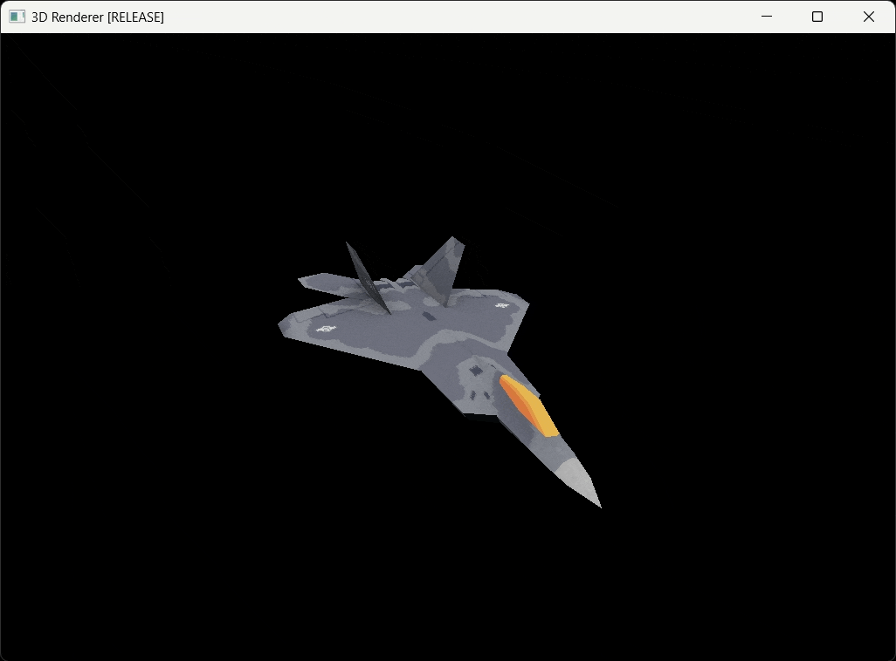

# 3D Renderer

Writing a 3D software renderer to learn the basics of 3D graphics.

Uses SDL for window and input management and for drawing pixels to a color buffer.

 

## Compiling and Running
Follow these steps to build and run the project:
1. Open `/projects/SoftwareRenderer.sln` in Visual Studio 2022.
2. Right click on the **3DRenderer** project and go to **Properties**.
3. Go to **Debugging** -> And set `Working Directory` to `$(SolutionDir)..\data\` for **All Configurations**.
4. Click OK.
5. Start debugging by clicking on the `Local Windows Debugger` green arrow. This will compile and run the project.

## Controls
- `Escape` to quit.
- `F9` to take a screenshot. Saved as `screenshot-{timestamp}.bmp` in the executable directory.
- `p` to pause.
- `f` to toggle logging of FPS and average frame time to the terminal.
- `g` to toggle rendering of background grid.
- `z` to toggle visualization of the Z buffer.
- `1` to draw only wireframe and vertices.
- `2` to display only wireframe.
- `3` to draw filled.
- `4` to draw both filled and wireframe.
- `5` to enable flat shading.
- `6` to disable shading.
- `7` to display textured.
- `8` to display textured and wireframe.
- `c` to toggle backface culling.
- `WASD` - Basic FPS camera movement.
- `up/down arrows`- Move camera up/down vertically.
